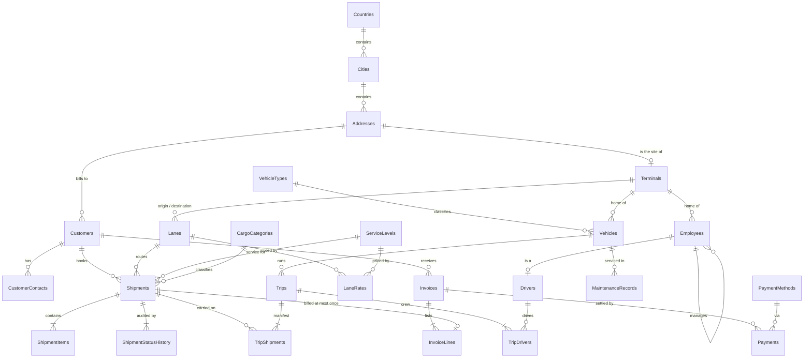

# NordFreight Logistics: SQL Server Database

A Microsoft SQL Server database for a regional road-freight carrier operating across the Baltic states, Poland, Finland and Germany. Customers book shipments between terminals. Dispatchers consolidate them onto trips run by a vehicle and a one- or two-person crew. Delivered freight is then invoiced and paid for.

The project covers schema design to roughly 3NF, constraints, indexing, views, functions, transactional stored procedures, triggers, realistic seed data, an advanced query set and an automated test suite. Every script has been run end to end against **SQL Server 2025 Express**.

---

## Contents

1. [How to run it](#how-to-run-it)
2. [Database architecture](#database-architecture)
3. [Main tables and relationships](#main-tables-and-relationships)
4. [Business rules](#business-rules)
5. [Index strategy](#index-strategy)
6. [Views](#views)
7. [Functions](#functions)
8. [Stored procedures](#stored-procedures)
9. [Triggers](#triggers)
10. [Seed data](#seed-data)
11. [Queries](#queries)
12. [Tests](#tests)
13. [Advanced SQL concepts demonstrated](#advanced-sql-concepts-demonstrated)
14. [Design decisions and known limitations](#design-decisions-and-known-limitations)

---

## How to run it

### Execution order

| # | Script | What it does |
|---|--------|--------------|
| 1 | `01 - Database Creation.sql` | Creates `NordFreightDB` and switches to it |
| 2 | `02 - Tables.sql` | 25 tables, plus 3 sequences for document numbers |
| 3 | `03 - Constraints.sql` | Foreign keys, UNIQUE and CHECK constraints |
| 4 | `04 - Indexes.sql` | Nonclustered, covering and filtered indexes |
| 5 | `05 - Views.sql` | 8 reporting views |
| 6 | `06 - Functions.sql` | 7 scalar and inline table-valued functions |
| 7 | `07 - Stored Procedures.sql` | 2 table types and 8 procedures |
| 8 | `08 - Triggers.sql` | 3 triggers |
| 9 | `09 - Seed Data.sql` | Realistic sample data covering the last 24 months |
| 10 | `10 - Queries.sql` | 54 example and business queries |
| 11 | `11 - Tests.sql` | 95 automated tests |

The order matters. Constraints need the tables. Seed data needs the procedures and triggers, because invoices and payments are created by calling the real procedures and every status change is audited by a trigger.

> **Warning:** `01 - Database Creation.sql` **drops an existing `NordFreightDB`** so the whole set can be re-run from a clean state. It never touches any other database.

### In SSMS or Azure Data Studio

Open each script in the order above and execute it (F5). The seed script is the slowest; it calls the invoicing procedure about 250 times.

### From the command line

`sqlcmd` (version 18+) from the scripts folder:

```powershell
$files = "01 - Database Creation.sql", "02 - Tables.sql", "03 - Constraints.sql",
         "04 - Indexes.sql", "05 - Views.sql", "06 - Functions.sql",
         "07 - Stored Procedures.sql", "08 - Triggers.sql", "09 - Seed Data.sql",
         "10 - Queries.sql", "11 - Tests.sql"

foreach ($f in $files) {
    sqlcmd -S ".\SQLEXPRESS" -E -C -b -I -i $f
    if ($LASTEXITCODE -ne 0) { Write-Error "Stopped at $f"; break }
}
```

| Flag | Why |
|------|-----|
| `-E` | Windows authentication |
| `-C` | Trust the local server certificate (sqlcmd 18 encrypts by default) |
| `-b` | Stop with a non-zero exit code on the first error |
| `-I` | Enable `QUOTED_IDENTIFIER`. Every script also sets it explicitly, because persisted computed columns and filtered indexes require it. |

`11 - Tests.sql` ends with `THROW` if any test fails, so `-b` makes it usable as a CI gate.

### Requirements

SQL Server **2017 or later** (any edition, including Express). The scripts use `CREATE OR ALTER`, `STRING_AGG`, `FORMATMESSAGE` with string templates, `DATEFROMPARTS`, `HASHBYTES('SHA2_256')`, sequences and window functions.

---

## Database architecture

### File layout

```text
database/
├── README.md
├── 01 - Database Creation.sql
├── 02 - Tables.sql              columns, PKs, defaults, computed columns, sequences
├── 03 - Constraints.sql         FKs, UNIQUE, CHECK (with the cascade policy)
├── 04 - Indexes.sql
├── 05 - Views.sql
├── 06 - Functions.sql
├── 07 - Stored Procedures.sql
├── 08 - Triggers.sql
├── 09 - Seed Data.sql
├── 10 - Queries.sql
└── 11 - Tests.sql
```

### Schema at a glance

| Subject area | Tables |
|--------------|--------|
| Geography | `Countries`, `Cities`, `Addresses` |
| Commercial | `Customers`, `CustomerContacts` |
| Network, fleet and staff | `Terminals`, `Employees`, `Drivers`, `VehicleTypes`, `Vehicles`, `MaintenanceRecords` |
| Service catalogue and pricing | `ServiceLevels`, `CargoCategories`, `Lanes`, `LaneRates` |
| Operations | `Shipments`, `ShipmentItems`, `ShipmentStatusHistory`, `Trips`, `TripDrivers`, `TripShipments` |
| Billing | `Invoices`, `InvoiceLines`, `PaymentMethods`, `Payments` |

**25 tables · 37 foreign keys · 32 UNIQUE constraints · 83 CHECK constraints · 27 nonclustered indexes · 8 views · 7 functions · 8 procedures · 3 triggers · 3 sequences · 2 table types**

### Conventions

- Surrogate `INT` / `BIGINT IDENTITY` primary keys. Natural keys (tracking number, VIN, tax number) are enforced with UNIQUE constraints instead.
- Every constraint and index has an explicit, predictable name: `PK_`, `FK_`, `UQ_`, `CK_`, `DF_`, `IX_`, `UX_` (unique filtered index).
- All timestamps are UTC `DATETIME2`, defaulted with `SYSUTCDATETIME()`. Mutable tables carry `CreatedAt` and `UpdatedAt`.
- Money is `DECIMAL(12,2)`, weights and volumes are `DECIMAL`, and all text is `NVARCHAR`.
- `ROWVERSION` columns on `Customers` and `Shipments` support optimistic concurrency.

### Entity-relationship diagram



---

## Main tables and relationships

### Relationship types

| Type | Where | How it is enforced |
|------|-------|--------------------|
| **One-to-one** | `Employees` ↔ `Drivers` | `Drivers.DriverId` is the primary key **and** the foreign key to `Employees`, so an employee can have at most one driver profile |
| **One-to-one** | `Terminals` → `Addresses` | UNIQUE on the FK column `Terminals.AddressId` (one site, one terminal) |
| **One-to-many** | `Customers` → `Shipments`, `Shipments` → `ShipmentItems`, `Invoices` → `Payments`, `Vehicles` → `Trips`, and more | Ordinary foreign keys |
| **Many-to-many** | `Trips` ↔ `Drivers` via **`TripDrivers`** | Composite PK `(TripId, DriverId)` and a role column |
| **Many-to-many** | `Trips` ↔ `Shipments` via **`TripShipments`** | Composite PK, plus a UNIQUE stop sequence per trip |
| **Many-to-many with payload** | `Lanes` ↔ `ServiceLevels` via **`LaneRates`** | Time-versioned prices with `EffectiveFrom` / `EffectiveTo` |
| **Self-referencing** | `Employees.ManagerId` → `Employees` | Walked by the recursive CTEs in queries Q21 and Q22 |

### Key tables

| Table | Purpose |
|-------|---------|
| `Shipments` | The central fact table: customer, lane, service level, cargo category, dates, weight, and the price charged at booking. `TotalAmount` is a persisted computed column. |
| `ShipmentStatusHistory` | Append-only audit of every status change, written by a trigger |
| `LaneRates` | Versioned price list. A new price closes the old one rather than overwriting it, so historic shipments stay auditable. |
| `Trips` | One vehicle movement between two terminals, with scheduled and actual times, odometer readings and fuel |
| `Invoices` / `InvoiceLines` | One line per shipment, with tax and line total as persisted computed columns |
| `Drivers` | Licence class and expiry, medical certificate, ADR (dangerous goods) endorsement, daily driving limit |

### Cascade policy

`ON DELETE CASCADE` is used **only** where a child row means nothing without its parent: contacts, a driver profile, shipment items and history, lane rates, a trip's crew and manifest, and invoice lines.

Everything else is `NO ACTION` on purpose. The database **refuses** deletes that would destroy history, such as a vehicle with maintenance costs, a shipment that has moved or been billed, or an invoice that has been paid. Records like these are retired with status flags instead.

---

## Business rules

| Rule | Enforced by |
|------|-------------|
| A shipment is invoiced **at most once** | `UQ_InvoiceLines_Shipment` (UNIQUE constraint) |
| At most one primary contact per customer | `UX_CustomerContacts_OnePrimary` (filtered unique index) |
| At most one Primary driver per trip | `UX_TripDrivers_OnePrimary` (filtered unique index); `usp_DispatchTrip` always adds one, and test T71 checks every trip has exactly one |
| One current (open-ended) price per lane and service level | `UX_LaneRates_OneCurrentRate` (filtered unique index) |
| A Delivered shipment must have a delivery date | `CK_Shipments_DeliveredHasDate` |
| A lane's implied average speed must be 20–110 km/h | `CK_Lanes_PlausibleSpeed` |
| VINs never contain I, O or Q | `CK_Vehicles_VIN` |
| Total payments can never exceed the invoice total, and the invoice status follows the payments | `TR_Payments_MaintainInvoiceStatus` |
| A trip's load can never exceed the vehicle's payload | `TR_TripShipments_EnforceCapacity`, also pre-checked in `usp_DispatchTrip` |
| Every shipment status change is audited | `TR_Shipments_TrackStatus` |
| Shipments move only through legal status transitions | State machine in `usp_UpdateShipmentStatus` |
| The price is the rate card effective on the pickup date | `fn_QuoteShipment` |
| A booking may not exceed the customer's available credit (unpaid invoices **plus** unbilled work) | `usp_CreateShipment` with `fn_CustomerAvailableCredit` |
| Drivers need a valid licence, medical and employment; ADR for dangerous goods; a licence class that covers the vehicle; and a leg within their daily driving limit | `usp_DispatchTrip` with `fn_IsDriverEligible` |
| Chilled and frozen cargo only travels on refrigerated vehicles | `usp_DispatchTrip` |
| Freight is only loaded onto a trip that starts or finishes on its route | `usp_DispatchTrip` |

---

## Index strategy

1. **No duplicates.** Primary keys and UNIQUE constraints already create indexes, so none are repeated.
2. **Foreign keys are indexed only when needed.** An FK that is already the leading column of a unique index (for example `CustomerContacts.CustomerId`) gets no extra index. Some FKs are deliberately left unindexed because they are never searched and their parents are never deleted.
3. **Covering composite indexes** match the reporting queries. For example, `IX_Shipments_PickupDate_Status` has `INCLUDE (CustomerId, CargoCategoryId, LaneId, FreightCharge, TotalAmount)`.
4. **Filtered indexes** stay small no matter how much history accumulates:
   - `IX_Shipments_Open` covers only freight still moving (the dispatch board).
   - `IX_Invoices_Outstanding` covers only unpaid invoices (receivables ageing).
5. **Filtered unique indexes enforce business rules** that a plain UNIQUE constraint cannot express ("one primary *per* customer").

---

## Views

| View | Shows | Techniques |
|------|-------|-----------|
| `vw_ShipmentDetails` | One readable row per shipment, with on-time flag, days late, revenue per km and billing state | 13-way join, LEFT JOIN, CASE, calculated fields |
| `vw_CustomerRevenueSummary` | Lifetime trading figures and outstanding balance per customer | Conditional aggregation, correlated subqueries |
| `vw_MonthlyRevenueTrend` | Monthly revenue with month-on-month growth, running total and 3-month moving average | CTE, `LAG`, windowed `SUM` / `AVG` |
| `vw_CargoCategoryPerformance` | Revenue share and rank per cargo category | `SUM() OVER ()`, `RANK` |
| `vw_LanePerformance` | Volume, revenue per km and on-time rate per lane | Aggregation over a LEFT JOIN |
| `vw_DriverUtilisation` | Trips, km, hours and compliance status per driver | Joins through the 1:1 and M:N tables |
| `vw_OutstandingInvoices` | Accounts-receivable ageing buckets | `OUTER APPLY`, CASE bucketing |
| `vw_FleetCostSummary` | Maintenance cost per km and fuel economy per vehicle | Two independent `OUTER APPLY` aggregates, so the totals don't multiply |

---

## Functions

Every function is used somewhere else in the project.

| Function | Type | Used by |
|----------|------|---------|
| `fn_GetEffectiveLaneRateId` | Scalar | `fn_QuoteShipment`: resolves the price in force on a date |
| `fn_QuoteShipment` | Inline TVF | `usp_CreateShipment` and the seed data: the single pricing engine |
| `fn_CustomerOutstandingBalance` | Scalar | `usp_RecordPayment`, the credit check, test T59 |
| `fn_CustomerAvailableCredit` | Scalar | `usp_CreateShipment` credit control |
| `fn_IsDriverEligible` | Scalar | `usp_DispatchTrip` crew checks |
| `fn_GetCustomerShipments` | Inline TVF | `usp_GetCustomerShipments` (a parameterised view) |
| `fn_ShipmentsAtRisk` | Inline TVF | Exception dashboard query Q49 |

Inline table-valued functions are preferred because the optimiser expands them into the calling query, where a multi-statement function would be a black box.

---

## Stored procedures

All write procedures share one pattern: `SET XACT_ABORT ON`, `BEGIN TRY` → `BEGIN TRANSACTION` → validate → write → `COMMIT`, and `BEGIN CATCH` → `ROLLBACK` if needed → `THROW`. Validation errors use numbered application errors in the 50000+ range, grouped by area.

| Procedure | What it does | Notable techniques |
|-----------|--------------|--------------------|
| `usp_CreateShipment` | Validates, weighs, prices and credit-checks a booking, then writes the shipment and its items atomically | Table-valued parameter, `UPDLOCK` on the customer row against concurrent over-booking, sequence-based tracking numbers |
| `usp_UpdateShipmentStatus` | Applies a status change and enriches the trigger's audit row | State machine held as data, `UPDLOCK` |
| `usp_DispatchTrip` | Creates a trip, rosters the crew, loads the manifest, and updates vehicle and shipment statuses; six tables in one transaction | Ten business checks, `UPDLOCK` on shipment rows so two dispatchers can't load the same pallet |
| `usp_CompleteTrip` | Completes a trip, releases the vehicle, advances its odometer and moves arrived freight to OutForDelivery | Distinguishes arrived freight from hub transfers |
| `usp_GenerateCustomerInvoice` | Bills all delivered, uninvoiced shipments in a period | Header totals derived from the lines, never passed in |
| `usp_RecordPayment` | Posts a payment against an invoice | `UPDLOCK` against double posting, trigger-maintained status |
| `usp_GetCustomerShipments` | Paged customer-portal lookup with optional filters | `OFFSET` / `FETCH`, `OPTION (RECOMPILE)` for the catch-all filter pattern, `@TotalRows` OUTPUT |
| `usp_GenerateMonthlyRevenueReport` | Monthly management pack: headline with year-on-year comparison, category ranking, top customers, lane performance | Four result sets, window functions |

---

## Triggers

Only three, each for a rule that no constraint can express:

| Trigger | Why it has to be a trigger |
|---------|---------------------------|
| `TR_Shipments_TrackStatus` | The audit trail must capture **every** status change, including ad-hoc `UPDATE`s and bulk fixes that bypass the procedures. An audit that only logs what the application remembers to log isn't an audit. |
| `TR_Payments_MaintainInvoiceStatus` | "Payments ≤ invoice total" and the derived Paid / PartiallyPaid status span two tables, and a CHECK constraint can only see its own row. It also handles `DELETE`, so reversing a payment reopens the invoice. |
| `TR_TripShipments_EnforceCapacity` | The load is a `SUM` across rows, and the limit sits three tables away (`Trips` → `Vehicles` → `VehicleTypes`). The whole manifest is re-summed, not just the inserted rows. |

All three are set-based on `inserted` / `deleted`. The audit and capacity triggers are also tested with multi-row statements.

---

## Seed data

`09 - Seed Data.sql` generates a realistic, **internally consistent** book of business covering the 24 months up to the day it is run, so date-relative queries stay meaningful.

| Data | Volume |
|------|--------|
| Countries / cities / addresses | 6 / 16 / 49 |
| Terminals / lanes / lane rates | 7 / 22 / 176 (two pricing generations) |
| Customers / contacts | 12 / 16, including one dormant and one closed account |
| Employees / drivers | 80 / 64, in a four-level reporting hierarchy |
| Vehicles / maintenance records | 54 / 217 |
| Shipments / items / status history rows | ~4,000 / ~10,000 / ~19,000 |
| Trips / manifest rows | ~2,300 / ~3,700 |
| Invoices / invoice lines / payments | ~250 / ~3,500 / ~240 |

How it is kept realistic and consistent:

- **Deterministic.** The data is generated from modulo arithmetic and `HASHBYTES`, never `RAND()` or `NEWID()`, so every run produces identical data and the tests are repeatable.
- **Business-shaped.** Volumes grow month on month. The top three customers account for about 45% of volume, and 64% of freight runs on eight trunk lanes.
- **Built through the real code.** Shipments are priced by `fn_QuoteShipment`; invoices and payments are created by calling `usp_GenerateCustomerInvoice` and `usp_RecordPayment`; statuses are walked with UPDATEs so the audit trigger writes a genuine history.
- **Physically possible.** Trips are consolidated up to three shipments per truck. Vehicles and drivers are allocated per departure day so nobody is double-booked. Hazmat trips get ADR-endorsed crews, long legs get co-drivers, and every odometer reading (trip, workshop and current) comes from one model, so it only ever increases.
- **Fails loudly.** If the fleet or driver pool were ever too small for the busiest day, the script stops with an error instead of producing impossible data.

---

## Queries

`10 - Queries.sql` contains 54 queries, each answering a real question. Every query is self-contained and uses dates relative to today, so any single query can be highlighted and run on its own.

| Section | Queries | Covers |
|---------|---------|--------|
| Basic | Q01–Q07 | `SELECT`, `WHERE`, `ORDER BY`, `DISTINCT`, `TOP`, `TOP WITH TIES`, `LIKE`, `BETWEEN`, `IN` |
| Intermediate | Q08–Q16 | `INNER` / `LEFT` / self joins, `GROUP BY`, `HAVING`, `CASE`, aggregates, the 1:1 relationship |
| Advanced | Q17–Q33b | Subqueries, correlated subqueries, recursive CTEs, `ROW_NUMBER` / `RANK` / `DENSE_RANK`, `LAG` / `LEAD`, `PARTITION BY`, `NTILE`, `EXISTS` / `NOT EXISTS`, relational division, conditional aggregation, `PIVOT`, `ROLLUP`, a 13-way join |
| Business / reporting | Q34–Q47 | Top customers (Pareto), monthly trend (MoM / YoY), category revenue share, top 3 per category, declining lanes and customers, dormant customers, on-time performance, receivables ageing, late payers, credit exposure, service due, driver league table, fleet utilisation |
| Views, functions, procedures | Q48–Q53 | Using the programmable objects |

---

## Tests

`11 - Tests.sql` runs **95 automated tests** and leaves the data exactly as it found it.

| Area | Examples |
|------|----------|
| Primary keys | Composite PK on a junction, the 1:1 driver profile, NULL keys |
| Foreign keys | Orphan inserts, protected deletes (`NO ACTION`), cascades that should happen |
| UNIQUE | Duplicate tax number, each filtered unique index, double billing |
| CHECK | Negative credit, implausible lanes, Delivered without a date, invalid VINs |
| Invalid inserts | NULLs, `TINYINT` overflow, impossible dates, silent truncation |
| Transactions | `XACT_ABORT ON` versus the `XACT_ABORT OFF` pitfall, `SAVE TRANSACTION`, procedure atomicity |
| Procedures | Success paths and every major validation error for all write procedures |
| Triggers | Multi-row audit, overpayment blocked, payment reversal, capacity limit |
| Functions and views | Pricing edge cases, eligibility rules, view and function agreement |
| Data integrity | 29 cross-table invariants, from pricing and invoice totals to double-booking, odometer continuity, hazmat crews and driving hours |
| Hygiene | Row counts and checksums of 17 tables are compared before and after the suite |

How the harness works:
- Each test runs in its own batch, inside a transaction that is rolled back.
- Results are recorded only **after** the rollback. Captured procedure output goes into table variables, which survive a rollback.
- Results go through a temporary stored procedure, so the suite adds nothing to the schema.
- Sequence values consumed by tests are not rolled back. That's standard SQL Server behaviour and harmless.

---

## Advanced SQL concepts demonstrated

| Concept | Where |
|---------|-------|
| Recursive CTE | Q21 (org chart), Q22 (headcount under each manager) |
| Ranking functions | Q23 (`ROW_NUMBER` vs `RANK` vs `DENSE_RANK` on ties), Q24, Q34, Q37, Q46 |
| `LAG` / `LEAD`, running totals, moving averages | Q25, Q26, Q35, `vw_MonthlyRevenueTrend` |
| `NTILE` segmentation | Q27 |
| Correlated subqueries | Q19, Q20, `vw_CustomerRevenueSummary` |
| `EXISTS` / `NOT EXISTS`, relational division | Q28, Q29, Q30 |
| Conditional aggregation, `PIVOT`, `ROLLUP` / `GROUPING` | Q31, Q32, Q33b |
| `CROSS APPLY` / `OUTER APPLY` | Q40, Q45, `fn_QuoteShipment`, `vw_FleetCostSummary` |
| Filtered and covering indexes | `04 - Indexes.sql` |
| Persisted computed columns, `ROWVERSION` | `02 - Tables.sql` |
| Sequences instead of `MAX() + 1` | Tracking, trip and invoice numbers |
| Table-valued parameters, inline TVFs | `usp_CreateShipment`, `usp_DispatchTrip`, `06 - Functions.sql` |
| `XACT_ABORT`, `TRY...CATCH`, `THROW`, `SAVE TRANSACTION` | `07 - Stored Procedures.sql`, tests T27–T30 |
| Pessimistic locking (`UPDLOCK`) under read-committed snapshot | Credit checks, dispatch, payments |
| `OFFSET` / `FETCH` paging, `OPTION (RECOMPILE)` | `usp_GetCustomerShipments` |
| Set-based triggers over `inserted` / `deleted` | `08 - Triggers.sql` |
| `INSERT ... EXEC`, temporary stored procedures | `09 - Seed Data.sql`, `11 - Tests.sql` |

---

## Design decisions and known limitations

### Normalisation (approximately 3NF)

Geography is fully normalised (Country → City → Address), lookups are separate tables, and every non-key column depends on its table's key. A few values are **deliberately stored even though they could be derived**, because the business requires a snapshot:

| Stored value | Why it is stored | What guards it |
|--------------|------------------|----------------|
| `Shipments.FreightCharge` / `SurchargeAmount` / `TaxAmount` | The price agreed at booking must not change when the rate card does | Test T62 re-prices every shipment |
| `Shipments.TotalWeightKg` / `TotalVolumeM3` | Read constantly by dispatch and reporting | Test T60 re-sums the items |
| `Invoices.Subtotal` / `TaxAmount` | An issued invoice is a legal document | Test T63 re-sums the lines |
| `Shipments.PromisedDeliveryDate` | The promise made at booking, even if transit times change later | n/a |

### Other trade-offs

- **Statuses are CHECK-constrained strings** rather than lookup tables. The sets are small and stable, and this keeps the queries readable. Lookup tables would be the purer 3NF choice.
- **VAT is a single constant** (20%) inside `fn_QuoteShipment`. A production system would keep a tax-rate table keyed by country and date.

### Known limitations

- No procedure moves a trip to `InProgress`; trips go straight from `Dispatched` to `Completed`.
- `fn_CustomerAvailableCredit` counts every uninvoiced, non-cancelled shipment as exposure, including old `Exception` shipments that may never be billed.
- Invoices become `Overdue` only when the seed script or a payment event re-evaluates them. A real system would run a scheduled job for this.